### Hi 👋, I'm Hrishikesh Patkal
### Full-Stack Developer | Cloud & DevOps Enthusiast | Generative AI Explorer
I build scalable web applications, automate delivery workflows, and explore AI-powered product experiences.

---

## 🚀 About Me

* 💻 Full-Stack Software Developer specializing in Angular, Node.js, TypeScript, and RESTful APIs.
* ☁️ Passionate about building scalable, cloud-native applications with modern architecture principles.
* 🚀 Experienced in developing responsive web applications focused on performance and user experience.
* 🔧 Interested in clean code, software design patterns, microservices, and maintainable systems.
* 🤖 Exploring Generative AI, OpenAI integrations, and intelligent application development.
* 🌐 Continuously expanding expertise in AWS, Kubernetes, Docker, and CI/CD automation.
* 📈 Focused on delivering reliable, secure, and high-quality software solutions.
* 🎯 Enjoy transforming complex business requirements into simple and effective products.

---

## 🎯 Career Focus

I am passionate about building scalable, high-performance applications and am actively seeking opportunities where I can contribute to impactful products and engineering excellence.

### 💼 Open to Roles

* **Full-Stack Developer** – Building end-to-end web applications using Angular, Node.js, TypeScript, and MongoDB.
* **Backend Developer** – Designing RESTful APIs, microservices, and scalable server-side solutions.
* **Software Engineer** – Developing reliable, maintainable, and performance-driven applications.
* **Cloud & DevOps Enthusiast** – Exploring AWS, Kubernetes, CI/CD, and cloud-native architectures.

📍 Open to **Remote**, **Hybrid**, and **On-site** opportunities.

### 🚀 What I Aim to Deliver

* Scalable and maintainable software solutions
* High-performance web applications and APIs
* Clean architecture and best engineering practices
* Improved system reliability and user experience
* Efficient development and deployment workflows

## 🏆 Highlights

* 4+ years of experience in Full-Stack Development
* Built and maintained enterprise-grade web applications using Angular and Node.js
* Developed REST APIs and microservice-based solutions for scalable systems
* Worked with AWS, Kubernetes, and modern DevOps practices
* Integrated AI-powered features and OpenAI-based solutions into applications
* Passionate about continuous learning, clean code, and software craftsmanship

---

## 🛠️ Tech Stack

### Frontend

### Backend

### Cloud, DevOps & AI

### Databases & Tools

---

## 📊 GitHub Analytics

  

---

## 📫 Connect With Me

  
  
  

---

### Code • Build • Deploy • Scale

Turning ideas into reliable software with modern technologies.

💡 Full-Stack Development • Cloud • DevOps • Generative AI

